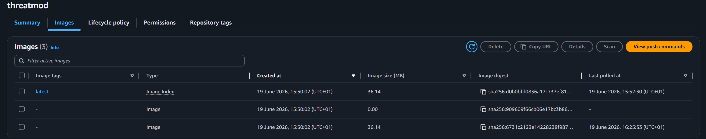
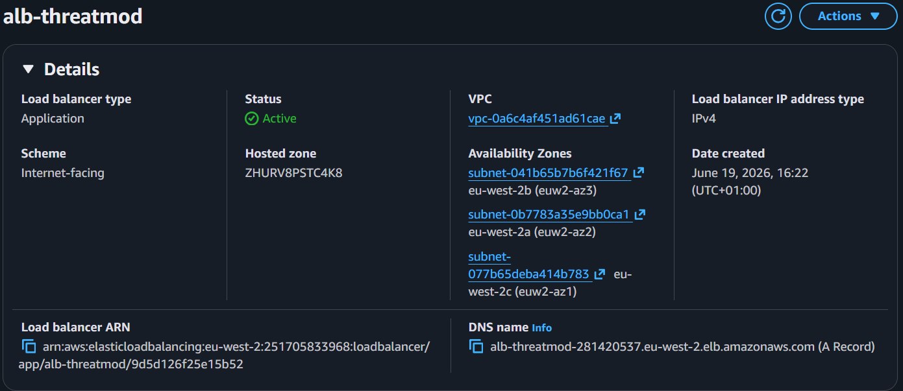

# ClickOps Deployment Flow

ECS deployment of the Threat Composer app via the AWS Console.

## 1. ECR

```text
ECR
└── Create ECR repository
    └── Tag Docker image
        └── Push image to ECR
```



## 2. ECS

```text
ECS
└── Create ECS Cluster
    └── Create Task Definition
        ├── Add ECR image URI
        ├── Set CPU/memory
        ├── Set container port
        └── Add execution role
```


## 3. Load Balancing

```text
Load Balancing
└── Create ECS Service
    └── Create/attach ALB
        └── Create Target Group
            └── Configure /health check
                └── Confirm target is healthy
```




## 4. Networking & Security

```text
Networking/Security
├── ALB Security Group
│   └── Allow HTTP 80 and HTTPS 443 from internet
│
└── ECS Task Security Group
    └── Allow traffic only from ALB security group
```


## 5. Domain & HTTPS

```text
Domain & HTTPS
└── Create Cloudflare CNAME
    └── Request ACM certificate
        └── Add ACM validation CNAME in Cloudflare
            └── Attach cert to ALB HTTPS listener
```


## 6. Validation

```text
Validation
└── Visit/curl final URL
    └── https://tm.samehrashid.com/health
        └── {"status":"ok"}
```

```bash
curl https://tm.samehrashid.com/health
# {"status":"ok"}
```


